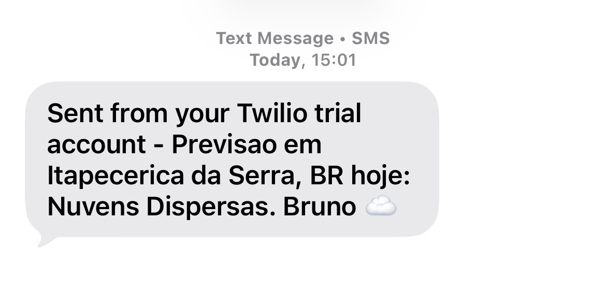
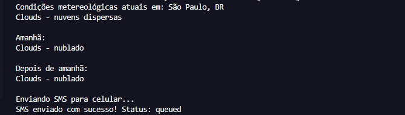

# 🌦️ Project Previsão Rápida do Tempo

> **Assistente Meteorológico Pessoal:** Um script Python que monitora o clima em tempo real e te avisa via SMS se você vai precisar de um guarda-chuva ou se pode curtir o sol.

---

## 📝 Descrição
O programa realiza requisições HTTP para a API do **OpenWeatherMap**, processando dados em formato JSON. Ele analisa a descrição do tempo e, caso a previsão indique "chuva", utiliza a API do **Twilio** para disparar um SMS automático para o seu celular. Se o dia estiver limpo, ele apenas te deseja um bom dia!




## 🚀 Funcionalidades
- **Consulta Automatizada:** Obtém dados climáticos precisos via linha de comando.
- **Exibição no Terminal:** Interface limpa mostrando as condições para hoje e os próximos dias.
- **Análise Lógica Dinâmica:** Identifica palavras-chave (chuva, sol, nuvens) para personalizar a resposta.
- **Notificação via SMS:** Integração direta com gateway de mensagens para alertas urgentes.
- **Segurança (DotEnv Style):** Uso de um arquivo de credenciais separado para proteger suas chaves de API.

## 🛠️ Tecnologias Utilizadas

| Ferramenta | Descrição |
| :--- | :--- |
| **Python 3** | Linguagem principal do projeto. |
| **OpenWeatherMap API** | Fonte de dados meteorológicos globais. |
| **Twilio API** | Serviço de mensageria para envio de SMS. |
| **Requests** | Biblioteca para consumo de APIs (HTTP). |
| **JSON/Sys** | Módulos nativos para tratamento de dados e argumentos de sistema. |

## ⚙️ Como Executar

### 1. Instale as dependências
Abra o seu terminal e instale as bibliotecas necessárias:
```bash
pip install requests twilio

###  Configure as suas credenciais:

Para garantir a segurança do seu código
, crie um arquivo chamado credenciais.py na mesma pasta do seu script principal (quickWeather.py) e insira as suas chaves de acesso. O arquivo deve ter a seguinte estrutura:

# credenciais.py

chave_api_clima = "SUA_CHAVE_DO_OPENWEATHERMAP"
accountSID = "SEU_ACCOUNT_SID_DO_TWILIO"
authToken = "SEU_AUTH_TOKEN_DO_TWILIO"
meuNumeroTwilio = "+1234567890" # O número virtual gerado pelo Twilio
meuCelular = "+5511999999999" # O seu número pessoal (cadastrado e verificado no Twilio

###  Execute o programa: 

No terminal, navegue até a pasta onde os arquivos estão salvos e execute o script. Lembre-se de passar o nome da cidade e a sigla do país. Dica: Coloque o nome da localidade entre aspas duplas caso ela possua espaços e vírgulas para que o terminal leia o argumento corretamente:

exemplo ->  python quickWeather.py "São Paulo, BR"
Aguarde alguns segundos e o alerta com a previsão chegará diretamente no seu celular!

TODOS RECURSO SÃO GRATUITOS.

link  https://openweathermap.org/
link https://www.twilio.com/