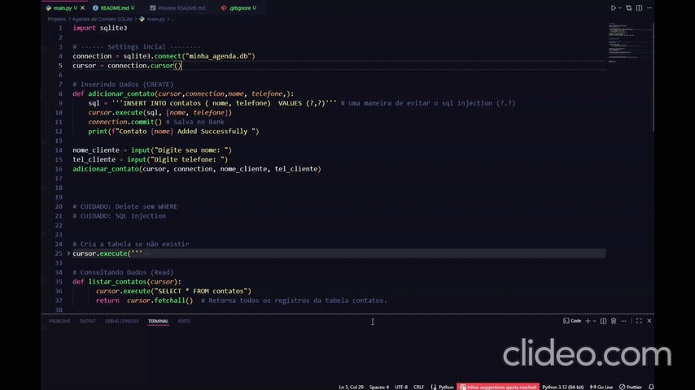

📱 Agenda de Contatos CRUD (Python + SQLite) 
_Este projeto foi o resultado de um Build Day focado em integrar Python com o banco de dados SQLite.  Mais do que um simples cadastro, o desenvolvimento deste script trouxe aprendizados profundos sobre como softwares interagem com o sistema de arquivos e como bancos de dados garantem a integridade das informações._

___
**🚀Funcionalidades**

**O sistema realiza o ciclo completo de um CRUD:**

**Create: Adiciona contatos com nome e telefone.**

**Read: Lista todos os registros salvos de forma formatada.**

**Update: Atualiza números de telefone utilizando o ID único do registro.**

**Delete: Remove contatos específicos, prevenindo a exclusão acidental de toda a base.**

___

🛠️ Tecnologias
Python 3

SQLite3

DBeaver (Visualização e Debug)

***

**🧠 Aprendizados e Desafios Superados (Build Day)**
**Durante o desenvolvimento, enfrentei e resolvi desafios técnicos fundamentais para qualquer pessoa que trabalha com dados:**

**1. O Mistério do Banco de Dados Invisível (Caminho Absoluto)**
**Um dos maiores aprendizados foi entender a diferença entre caminhos relativos e Caminhos Absolutos.**

**O Problema: O Python estava criando o arquivo do banco em um local e o DBeaver estava tentando ler de outro, especialmente devido à sincronização do OneDrive, que cria camadas de atalhos virtuais.**

**A Solução: Implementei o uso de os.path.abspath para garantir que ambas as ferramentas estivessem apontando para o exato mesmo endereço físico no disco rígido. Aprendi que o SQLite não é um servidor na nuvem, mas um arquivo real que precisa ser localizado com precisão.**

___
**2. A Importância do connection.commit()**
**Aprendi que, no SQL, realizar uma operação não significa que ela foi salva.**

**O Conceito: As alterações (Insert, Update, Delete) ficam em uma área de memória temporária.**

**A Prática: Sem o comando .commit(), os dados se perdem assim que o script fecha. Este projeto solidificou a importância de "confirmar" as transações para garantir a persistência dos dados.**

___

**3. Segurança e Prevenção de SQL Injection**
**Seguindo as boas práticas, utilizei parâmetros vinculados (?) em todas as consultas. Isso impede que comandos maliciosos sejam injetados através das entradas do usuário, garantindo a segurança da aplicação.**

___
